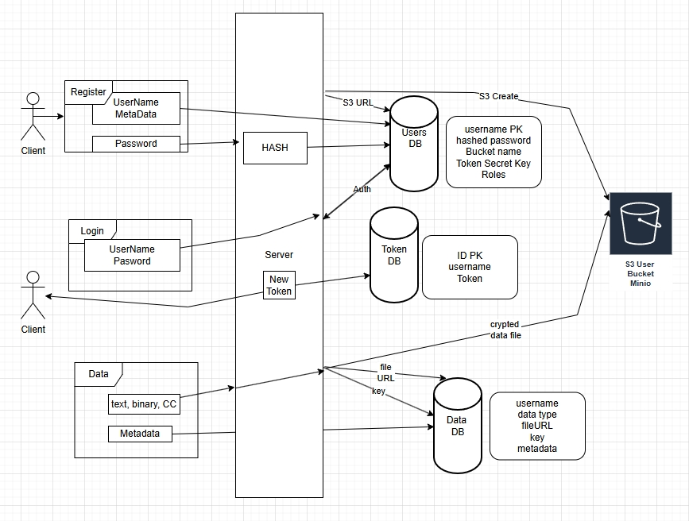

modernc.org/sqlite


## Выпускной

Докеризовано.<br>
Используется контейнеры базы данных Postgres и S3-совместимого локального хранилища Minio<br>
Сначала необходимо создать сертификаты в папке cmd/tls, в makekey.bat команда<br>
Затем запустить контейнеры, в папке cmd **docker-compose up -d**  <br>
cmd/server - сервер, сбилдить запустить <br>
cmd/client - клиент работающий по CLI <br>


Логика : <hr>

Три таблицы <br>
USERA. Содержит логин, пароль, имя бакета юзера, ключ шифрования бакета, при внесении в таблицу кодируется мастер-ключом<br>
TOKENA. При логине в него прописывается токен и пересылается Клиенту, который сохраняет его в локальном файле<br>
DATAS. В неё записываются параметры переданных данных - имя файла в бакете, ключ кодирования файла, типа данных (текст, файл, кредитка) <br>
Ключ кодирования файла шифруется ключом бакета<br>



CLI <br>
```
client -register="username, password" Регистрация нового юзера
client -login="username, password"  Логин на сервер

client -putfile="путь к файлу/имя файла"    Запись файла в хранилище
client -puttext=" в кавычках текст "        Запись текстовых данных
client -putcard=" номер, ММ/YY, CSV, Card Holder"   Запись данных банковской карты

       -update=id при наличии этого флага совместно с putfile || puttext || putcard 
            обновляются (фактически перезаписываются) данные записи с номером id

client -list        Вывод на экран списка загруженных данных, первый столбец ID - номер 
client -show=id     Вывод на экран параметров записи с номером id

client -get=id      id-номер записи для сохранения содержимого в локальный файл, 
                    по умолчанию имя такое же, как в бакете S3
       -file="filename" - путь/имя файла, совместно с -get

client -remove=id   id-номер записи для удаления

Флаг -meta="... метаданные ..." - внесение метаданных в таблицу при любой записи, в т.ч. регистрации
```

<hr>
Параллельно с внесением записей в БД и S3 сервера это же прописывается в локальный SQLite и файловое хранилище<br>
для Read-Only доступа когда сервер недоступен<br>
В это случае активны флаги только на чтение (login, list, show, get) <br>
register, put-ы, remove - отсутствуют<br>


